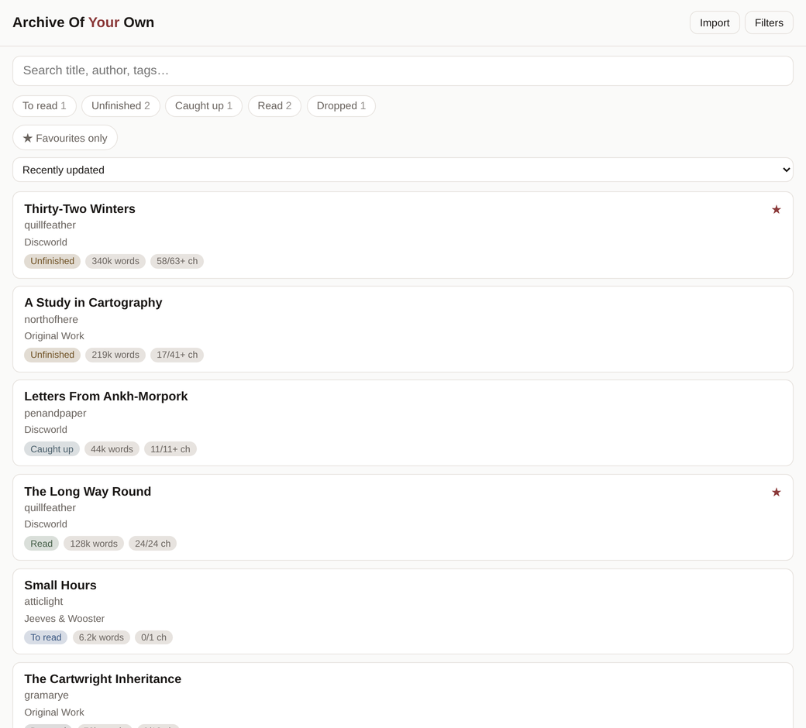
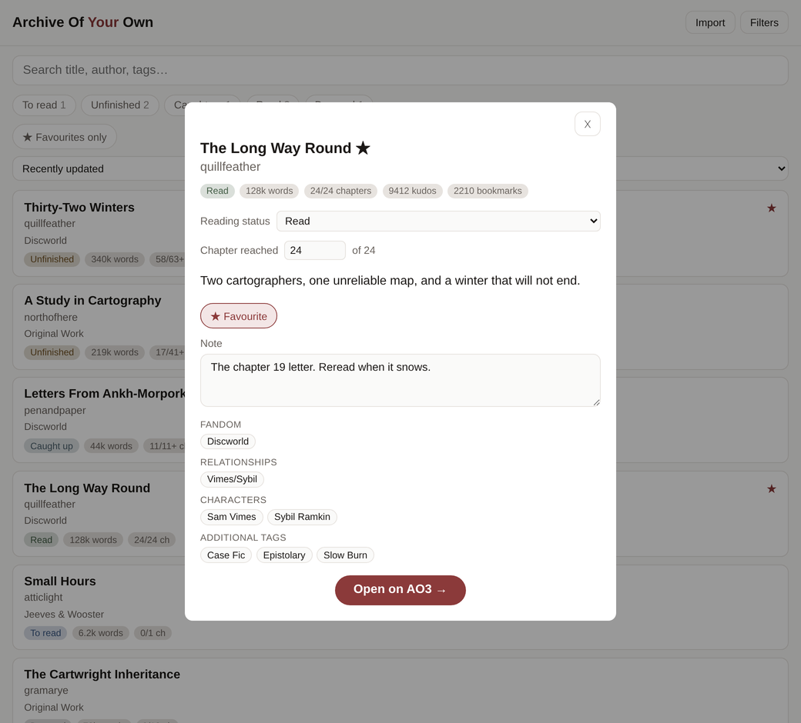

# An Archive Of Your Own

A personal reading list for Archive of Our Own (AO3), with a way to remember
where you left off. Keep track of fics you want to read, have finished or
abandoned, or are waiting on the author to update.

Paste a work or series link to save its details. Paste a chapter link to record
your progress too. You can search and browse your saved list offline; importing
or refreshing a fic needs a connection to AO3. The app stores metadata and your
reading notes, not copies of the stories.



It runs locally with a small Node.js server, a SQLite database and a plain
HTML/CSS/JavaScript frontend. There are no package dependencies or build steps.

## Project status

**Complete and retired.** This project is not under active development.
See the [prototype retrospective](docs/retrospective.md) for its goals,
findings and lessons for a rewrite.

## Quick start

You'll need **Node.js 24 or later** and the **`sqlite3` command-line tool**.
The app uses Node's built-in SQLite support.

From the project directory, create an empty archive and start the server:

```sh
sqlite3 db/ao3.sqlite3 < db/schema.sql
npm start
```

Open [localhost:4173](http://localhost:4173), click **Import**, and paste an AO3
link. If you already have a database, see [Database setup](#database-setup)
before running the schema command.

Public works can be imported without any configuration. To import works
restricted to logged-in readers, add an AO3 session cookie as described below.

## Configuration

To change the defaults, copy `.env.example` to `.env` and edit it. `npm start`
loads this file at startup, so restart the server after making changes.

| Variable | Purpose and default |
|---|---|
| `AO3_SESSION` | The `_otwarchive_session` cookie from a logged-in AO3 session. Needed only for works restricted to logged-in readers. See [ADR-0002](docs/decisions/0002-authenticate-with-an-ao3-session-cookie.md). |
| `ARCHIVE_CONTACT` | Contact address included in the `User-Agent`, so AO3 can contact the person running the client. |
| `AO3_MIN_INTERVAL_MS` | Minimum time between AO3 requests, in milliseconds. Default: `5000`. Tests set this to `0`. |
| `HOST` | Network interface to listen on. Default: `127.0.0.1` (this machine only). |
| `PORT` | HTTP port. Default: `4173`. |
| `DB_PATH` | Database file. Default: `db/ao3.sqlite3`. |

The `.env` file is gitignored because the session cookie grants access to your
AO3 account. If the cookie expires, imports report `expired_session`; replace
it and restart the server.

AO3 displays dates in the logged-in account's timezone. Keep the account used
for `AO3_SESSION` set to UTC to avoid dates that differ by a day from the rest
of the database.

## Using the archive

Use the search box, status filters, favourites toggle and sort menu to find a
fic. **Load more** shows the next page. Filters are saved in the URL, so you can
bookmark a view or reload without losing it.

Click a card to open its details, including the summary, tags and reading
controls.



- **Import** saves a work or series and opens its details. Importing the same
  link again refreshes its metadata. Imports run one at a time and can take a
  few seconds; any error appears in the form.
- **Reading status** lets you choose a status yourself. Imports will preserve
  that choice until you change the chapter position without choosing a status.
- **Chapter reached** records your position and updates the status to match.
  This field appears only for works with multiple chapters.
- **Continue Reading** opens the chapter link you last imported. If there is
  no saved chapter link, **Open on AO3** opens the work or series instead.
- **Favourite** saves when you change it. **Note** saves when you leave the
  field. Both survive re-imports.

Edits are confirmed by the server. If a save fails, the control returns to its
previous value and shows an error. The browser's Back button closes the detail
dialog, and keyboard focus returns to where you opened it.

### How reading status works

A chapter link is treated as the place you stopped reading. A work or series
link on its own doesn't record a position.

| Imported link | Status for a new entry |
|---|---|
| Work or series link without a chapter | `to_read` |
| First chapter | `to_read` |
| Later chapter, before the last posted chapter | `unfinished` |
| Last posted chapter of an ongoing work | `caught_up` |
| Last posted chapter of a completed work | `read` |

Chapter 1 counts as opening a fic, so a single-chapter work is never marked
read automatically. Set it to `read` yourself when you're done. The `dropped`
status is always a manual choice.

For an existing entry, importing a link without a chapter leaves all reading
state alone. Importing a chapter link updates the position and recalculates the
status unless you've chosen one manually.

Progress on cards and in the detail dialog uses the number of chapters
actually posted. For example, `7/11+` means you've reached chapter 7, there are
11 chapters available, and the work is still ongoing. The author's planned
chapter total isn't shown. Series have no chapter count, so they don't show a
progress badge.

Entering a chapter number by hand clears the saved **Continue Reading** link:
AO3 chapter URLs use an ID that can't be reconstructed from a chapter number.
Import a chapter link to restore it. Setting a chapter also updates
`last_read_at`; clearing the position does not.

See [ADR-0003](docs/decisions/0003-derive-reading-status-from-the-pasted-chapter-link.md)
for the reasoning behind these rules.

## Database setup

Database files (`db/*.sqlite3`) are gitignored, so a fresh clone has no saved
fics. For a new archive, use the current schema:

```sh
sqlite3 db/ao3.sqlite3 < db/schema.sql
```

For an older database, apply only the migrations it hasn't received, in order.
A database created from the current schema doesn't need these migrations.

| File | Change |
|---|---|
| `db/migrate_001.sql` | Adds `enriched_at`, `fetch_status`, `fetch_error`, and a search index that supports re-indexing in place. |
| `db/migrate_002.sql` | Adds the `caught_up` reading status. |
| `db/migrate_003.sql` | Fills in missing reading positions for fics marked `read` or `caught_up`. |

```sh
sqlite3 db/ao3.sqlite3 < db/migrate_001.sql
sqlite3 db/ao3.sqlite3 < db/migrate_002.sql
sqlite3 db/ao3.sqlite3 < db/migrate_003.sql
```

Back up your database before migrating. Migration 002 rebuilds the `fic` table
because SQLite can't change its `CHECK` constraint in place. Migration 003
copies the posted chapter count into missing reading positions; it leaves
other fields alone and is safe to run again.

If an import reports `locked`, another program may be holding a write lock on
the database. Close the database browser or finish its transaction, then retry.
The server waits five seconds for a lock before returning this error.

## Technical reference

### Data model

[`db/schema.sql`](db/schema.sql) defines two tables and a search index.

**`fic`** stores one row per AO3 work or series, identified by `slug`, with
`kind` distinguishing the two. Its columns fall into four groups:

| Group | Fields and write rules |
|---|---|
| AO3 metadata | Title, author, summary, word count, chapter counts, rating, kudos, bookmarks and dates. Refreshed on import. |
| Reader's notes and favourites | `note` and `favourite`. Changed only by the reader. |
| Reading state | `status`, `chapter`, `resume_url`, `last_read_at`, `state_changed_at` and `state_source`. Stored locally; a chapter import can update progress, but preserves a manually chosen status. |
| Fetch tracking | `enriched_at`, `fetch_status` and `fetch_error`. Record fetch attempts and failures. |

`state_source` is `import` when the status can be calculated from the chapter
position, and `user` when the reader has chosen a status manually.
`fetch_status` is `ok`, `restricted`, `missing` or `error`; `NULL` means the
entry has never been fetched. The schema accepts `fichub`, but no code writes
that value. See [ADR-0001](docs/decisions/0001-scrape-ao3-directly.md).

**`fic_tag`** stores `(fic_id, tag_type, tag)`. Tag types are `fandom`,
`relationship`, `character`, `freeform`, `category`, `warning` and `genre`.

**`fic_fts`** is an FTS5 index of titles, authors, summaries and tags. Notes
aren't indexed. The index is contentless (`content=''`) with
`contentless_delete=1`, allowing entries to be deleted and re-indexed in place.
There are no triggers: the store code maintains the index and must set each
`rowid` to the matching `fic.id` for search joins to work.

The server uses `db/schema.sql` only. Unused schema files are documented in
[the project history](docs/history.md).

### Import pipeline

The app fetches AO3 work and series pages directly and parses their metadata.
[ADR-0001](docs/decisions/0001-scrape-ao3-directly.md) explains that choice.
`POST /api/import` connects the following steps.

**Fetch — `server/import.js`**

- `normalizeUrl(input)` returns `{ kind, slug, url, chapter_id }`, or `null`
  for an unsupported link. It normalises chapter links, adult-view parameters,
  fragments, collection paths and hostnames without a scheme to the same work
  or series identity. A chapter ID identifies an AO3 chapter, not its position
  within the work.
- `fetchAo3(url)` returns `{ status: 'ok', html, url }` on success, or a status
  of `restricted`, `expired_session`, `missing` or `error`. Requests run one at
  a time, five seconds apart by default. HTTP 429 and 5xx responses are retried
  with backoff, respecting `Retry-After`.

**Parse — `server/parse.js`**

- `parseWork(html)` and `parseSeries(html)` return the `fic` fields and tags
  grouped by type. They read the page's metadata block and throw if it's
  missing, so a markup change won't silently replace saved data with blanks.
- A work is complete when all its planned chapters have been posted. Chapter
  counts determine `is_complete`, since AO3 sometimes omits the
  "Completed:"/"Updated:" row.
- `chapter_ids` lists the chapter menu in order, letting the store convert a
  chapter ID to a position. Single-chapter works have no menu.
- Series pages don't provide ratings, kudos, chapter counts or full tag lists.
  Those fields are returned as `null` or empty.

**Save — `server/store.js`**

- `upsertFic(db, target, record)` inserts or refreshes the fic, tags and search
  index in one transaction. Notes and favourites are preserved. Reading state
  changes only when the imported link identifies a chapter; manually chosen
  statuses are preserved too.
- `deriveStatus({ chapter, chapters_done, is_complete })` implements the
  [reading status rules](#how-reading-status-works).
- `applyReadingState(db, id, { status, chapter })` handles manual progress and
  status edits.
- `setCuration(db, id, { favourite, note })` handles favourites and notes.
  Blank notes are stored as `NULL`.
- `recordFetchFailure(db, slug, status, error)` records a failed fetch for an
  existing fic without changing its saved metadata. Failed imports of new
  links leave no empty rows behind.

### API

| Endpoint | Request and response |
|---|---|
| `GET /api/fics` | Returns `{ items, total, limit, offset }`. Each item includes a `fandoms` array. |
| `GET /api/fics/:id` | Returns one fic with tags grouped by type. |
| `GET /api/meta` | Returns counts by reading status. |
| `POST /api/import` | Accepts `{ url }`; returns `{ fic, created }`. HTTP `201` for a new fic, `200` for an existing one. |
| `PATCH /api/fics/:id` | Accepts `{ status?, chapter?, favourite?, note? }`; returns the updated fic. At least one field is required. |

#### Updating a fic

For `PATCH`, the fields have these effects:

- `chapter` sets the reading position, recalculates the status and sets
  `state_source = 'import'`. A later chapter import can update the status again.
- `status` sets a manual status and `state_source = 'user'`, preserving that
  choice during imports.
- Sending both sets the chapter and keeps the supplied status.
- `favourite` accepts a boolean. `note` accepts a string or `null` to clear it.
  Neither changes reading state.

The entire request is validated before any fields are written. Request bodies
are limited to 4 KB, including the JSON surrounding a note.

#### Filtering and sorting

`GET /api/fics` accepts these query parameters:

| Parameter | Behaviour |
|---|---|
| `q` | Full-text search. Each word is a prefix match, and all words must match. Punctuation-only input matches nothing. |
| `status` | Comma-separated statuses; matches any status in the list. |
| `favourite=1` | Shows favourites only. |
| `sort` | `updated_at` (default), `published_at`, `word_count`, `kudos` or `title`. |
| `dir` | `desc` (default) or `asc`. Missing values sort last. |
| `limit` | Page size, from 1 to 100. Default: `30`. |
| `offset` | Number of results to skip. |

Search input is split into runs of letters and digits, quoted, given a trailing
`*` and joined with `AND`. This keeps user input from causing FTS5 syntax errors.

#### Errors

Failed requests return `{ error, message }`.

| `error` | HTTP | Meaning |
|---|---|---|
| `bad_body` | 400 | The body couldn't be read as JSON, or exceeded the size limit. |
| `bad_url` | 400 | The URL isn't a supported AO3 work or series link. |
| `bad_status` | 400 | The status isn't one of the five supported values. |
| `bad_chapter` | 400 | The chapter isn't a whole number within the work's chapter count, or was supplied for a series. |
| `bad_favourite` | 400 | The value isn't `true` or `false`. |
| `bad_note` | 400 | The value isn't a string or `null`. |
| `empty_patch` | 400 | None of the four editable fields was supplied. |
| `expired_session` | 401 | The session cookie no longer works. Replace it and restart. |
| `restricted` | 403 | The work requires a login and no `AO3_SESSION` is set. |
| `missing` | 404 | AO3 has no such work; it may have been deleted. |
| `locked` | 503 | Another program holds the database write lock. |
| `error` / `unparseable` | 502 | AO3 couldn't be reached, or its page couldn't be parsed. |

For an existing fic, `restricted`, `missing` and `error` outcomes are also saved
in `fetch_status` and `fetch_error`.

### Frontend implementation

`public/` contains plain HTML, CSS and one JavaScript file. Search is debounced
by 300 ms. Filters use `replaceState` to update the URL without adding a browser
history entry for each change; opening a detail dialog adds its own entry so
Back can close it.

List and detail requests are numbered so older responses can't overwrite newer
results. Pagination advances by the number of items actually rendered, avoiding
gaps after failed or superseded requests.

Edits update the dialog from the server response, keeping status calculation
in one place. Notes save without rebuilding the list; favourites refresh it
because they affect both card stars and filtering. The dialog traps and restores
keyboard focus, and a live region announces the result count.

## Tests

```sh
npm test
```

The 101 tests use Node's built-in `node:test` runner. They run without network
access or fixture downloads.

| File | Coverage |
|---|---|
| `server/app.test.js` | HTTP requests over a real socket with an in-memory database: filtering, search, sorting, pagination, patch validation, errors and static files. |
| `server/store.test.js` | Import updates, reading status rules, notes and favourites. |
| `server/parse.test.js` | Parsing captured AO3 pages. |
| `server/fetch.test.js` | Rate limits, retries, `Retry-After`, and restricted, expired-session and missing-work responses. |
| `server/import.test.js` | URL normalisation. |

Parser tests use six captured pages, trimmed to remove story text. See the
[fixture notes](server/fixtures/README.md).

## Project layout

```text
server/server.js       Startup, database connection and access log
server/app.js          HTTP routes, validation and queries
server/import.js       AO3 URL normalisation and fetching
server/parse.js        Work and series page parsing
server/store.js        Database writes
server/fixtures/       Captured pages for parser tests
server/*.test.js       Test suites
public/                HTML, JavaScript and CSS
db/schema.sql          Current schema
db/migrate_00*.sql     Database migrations, applied in order
docs/decisions/        Architecture decision records
docs/history.md        Notes on files kept for historical context
docs/retrospective.md  Prototype findings and lessons
docs/img/              README screenshots
```

## Known limitations

- Metadata refreshes only when you re-import a fic; there is no scheduled
  refresh. Importing a bare work link leaves reading progress unchanged.
- Reading state and notes/favourites are saved separately. Validation happens
  before either write, but a crash between them can leave a partial update.
- Search indexing depends on `server/store.js`. Direct database edits must
  update `fic_fts` too.
- AO3 markup changes can break imports. Parser tests use captured pages and
  don't check the live site.

## Licence

[MIT](LICENSE).

This project isn't affiliated with or endorsed by Archive of Our Own or the
Organization for Transformative Works. Please keep requests spaced out (five
seconds apart by default) and include a contact address in the `User-Agent`.
